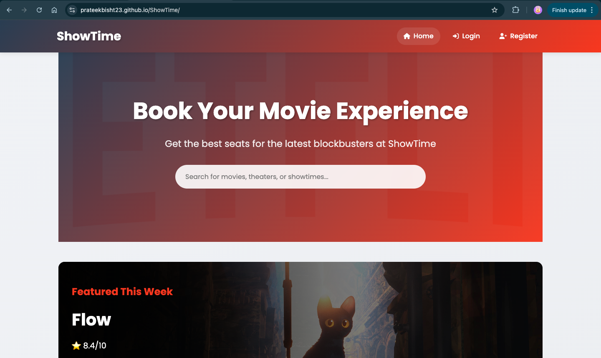
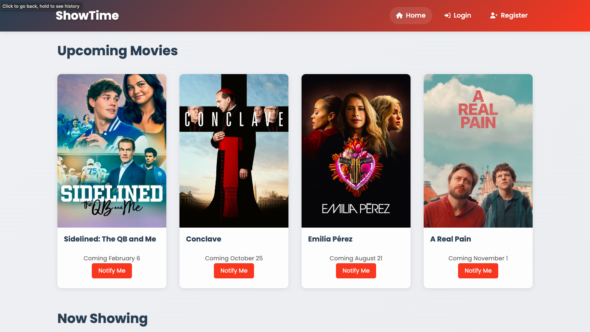
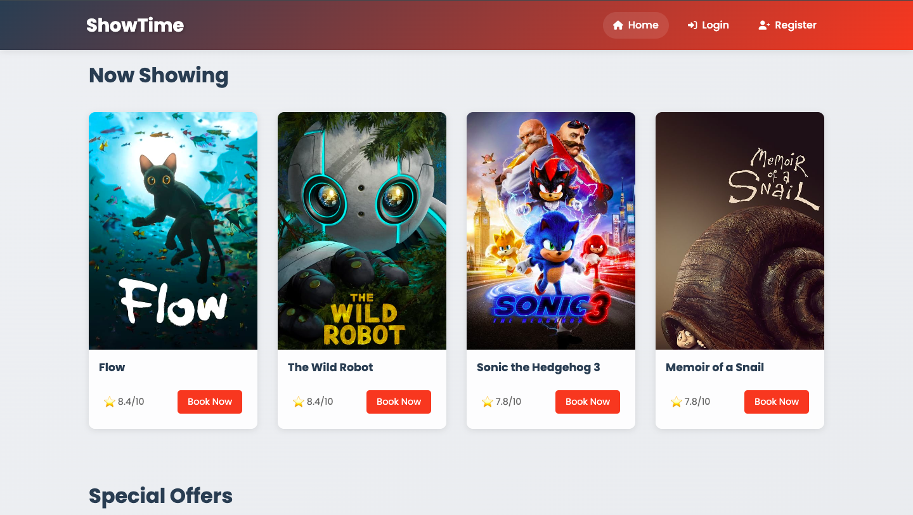
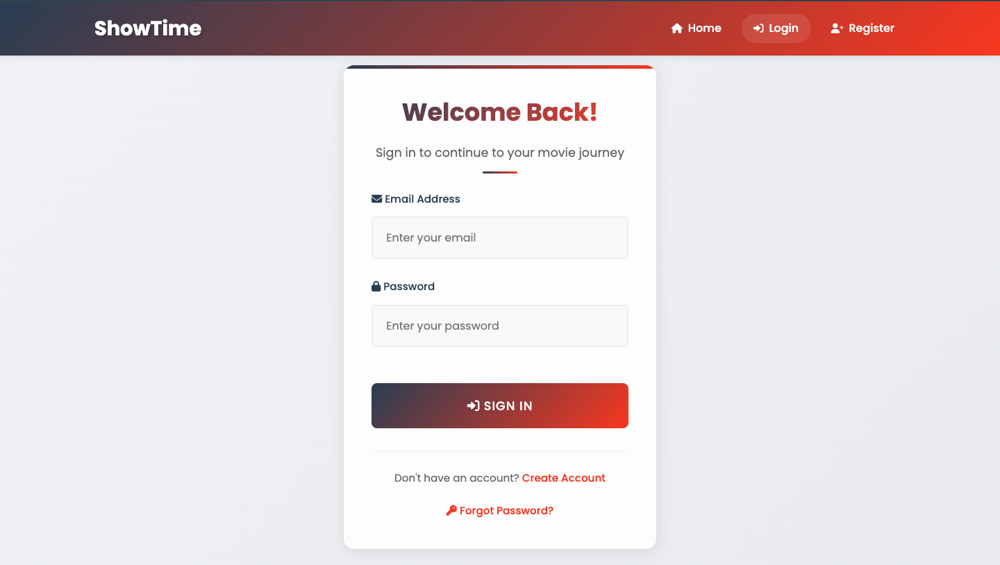

# ShowTime - Movie Ticket Booking Website

👉 **[Visit the Website](https://prateekbisht23.github.io/ShowTime/)** 👈

ShowTime is a modern, responsive movie ticket booking website built with HTML, CSS, and JavaScript. It provides users with a seamless interface to browse movies, view details, and (conceptually) book tickets.

## 🎬 Features

### Movie Browsing

- **Now Showing**: Display currently playing movies with ratings and booking options
- **Upcoming Movies**: Showcase upcoming releases with release dates and notification options
- **Featured Movies**: Highlight top-rated movies with detailed information
- **IMDB Integration**: Direct links to IMDB pages for each movie

### User Interface

- **Search Functionality**: Search bar for movies, theaters, and showtimes (visual)
- **Responsive Design**: Fully responsive layout that works on all devices
- **Modern UI**: Clean and intuitive interface with smooth animations
- **Dynamic Content**: Real-time movie data fetched from TMDB API

### Special Features

- **Student Discounts**: Special pricing for students
- **Family Packages**: Group booking offers
- **Weekday Specials**: Discounted rates for morning shows
- **Newsletter**: Email subscription for updates and offers

## 🛠️ Technologies Used

- **HTML5**: Semantic markup for structure
- **CSS3**: Modern styling with:
  - Flexbox and Grid layouts
  - CSS Variables
  - Animations and transitions
  - Responsive design
- **JavaScript**: Dynamic content and interactions
- **APIs**:
  - TMDB API for movie data
  - IMDB integration for movie details
- **External Libraries**:
  - Font Awesome for icons
  - Google Fonts (Poppins)

## 🔧 Setup and Installation

1. Clone the repository:

   ```bash
   git clone https://github.com/yourusername/showtime.git
   ```

2. Add your TMDB API key in `js/config.js`:

   ```javascript
   const config = {
     tmdbApiKey: "YOUR_API_KEY",
     tmdbBaseUrl: "https://api.themoviedb.org/3",
     tmdbImageBaseUrl: "https://image.tmdb.org/t/p/w500",
     tmdbBackdropBaseUrl: "https://image.tmdb.org/t/p/original",
   };
   ```

3. Open `index.html` in your browser


## Screenshots

### Home Page


### Upcoming Movies Section


### Now Showing Movies Section


### Login Page



## 🚀 Future Enhancements

- Backend integration for:
  - User authentication
  - Real ticket booking functionality
  - Payment processing
  - Seat selection
  - User profiles
- Theater selection
- Show timing selection
- Real-time seat availability
- Payment gateway integration
- Booking history
- User reviews and ratings


## 🤝 Contributing

Contributions are welcome! Please feel free to submit a Pull Request.

## 👥 Authors

- Prateek Bisht - Initial work

## 🙏 Acknowledgments

- TMDB API for movie data
- Font Awesome for icons
- Google Fonts for typography
- Unsplash for placeholder images
